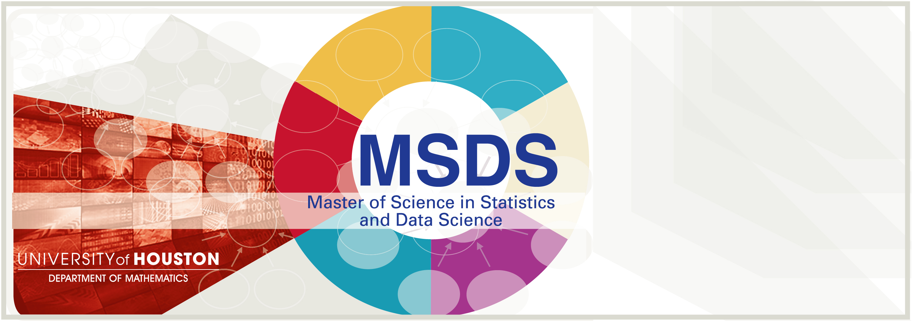

# Projects from MSDS Program
## Author: Jake Zhu
---
Here contains multiple projects completed during my Master's program at University of Houston.

Courses and Professors:
- MATH 6350 - Statistical Learning and Data Mining - Dr. Robert Azencott / Dr. John Ryan
- MATH 6357 - Linear Models and Design of Experiments
- MATH 6358 - Probability Models and Statistical Computing
- MATH 6359 - Applied Statistics and Multivariate Analysis
- MATH 6373 - Deep Learning and Artificial Neural Networks - Dr. Robert Azencott
- MATH 6380 - Programming Foundation for Data Analytics
- MATH 6381 - Information Visualization
- MATH 6386 - Big Data Analytics 
- MATH 6397 - Financial & Commodity Markets - Dr. John Ryan
- MATH 6315 - Masters Thesis Tutorial - 
